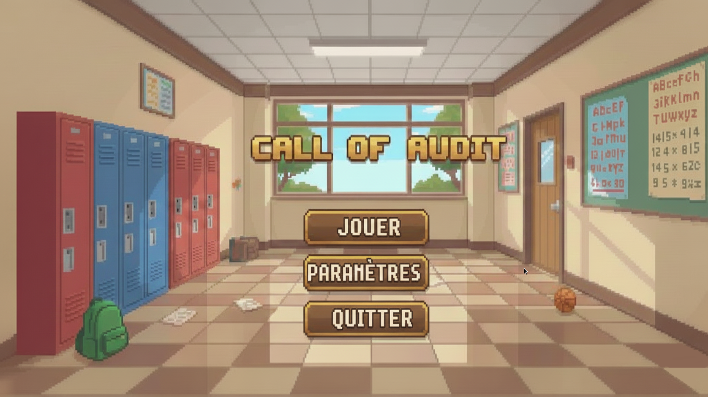
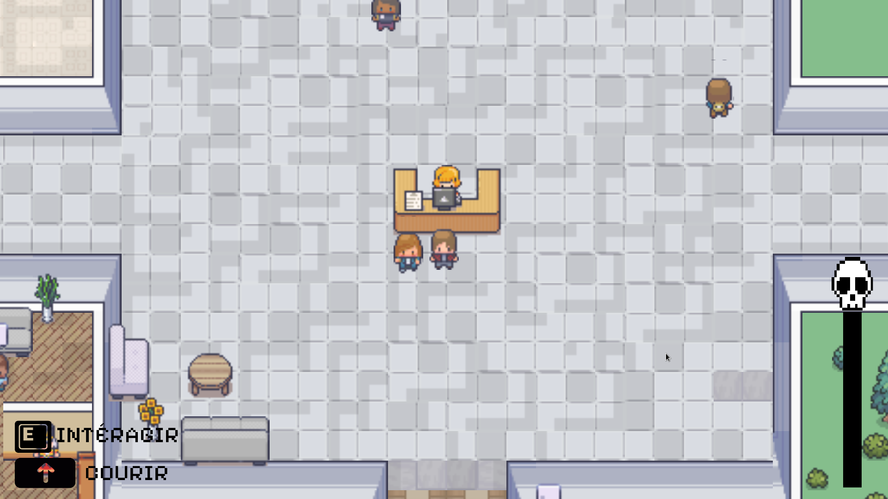
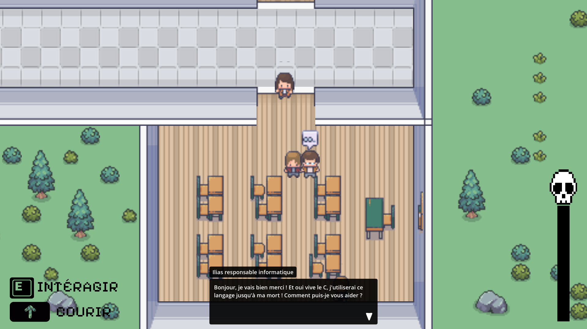

# Call Of Audit (MET25C-C)

## Équipe

- Lucas  
- Ferencz  
- Maxime

## présentation
- Dans notre jeu, le joueur doit réaliser un audit pour l'IUT Robert Schuman. Il est missioné par le directeur de l'IUT et doit se rendre dans plusieurs services de l'IUT pour récupérer des informations. Lorsqu'il est passé par tous les services il peut rendre son rapport au directeur et obtenir son score.

## Captures d'écran de notre jeu

- Menu de Call Of Audit  

- Rendez vous au guichet si vous ne savez pas ou aller!  

- Des dialogues immersifs et des PNJ à l'effigie de professeurs

## Téléchargement

- [installateur windows](Installateur/)

## Crédits

- doubleur du PNJ Ilias :  Ilias Rmouque
- musique du menu : Unbroaken Road (https://youtu.be/PAhZIQvJdlY?si=9s8Lo5sCiq1EME5E)
- Godot Engine (https://godotengine.org/license)
